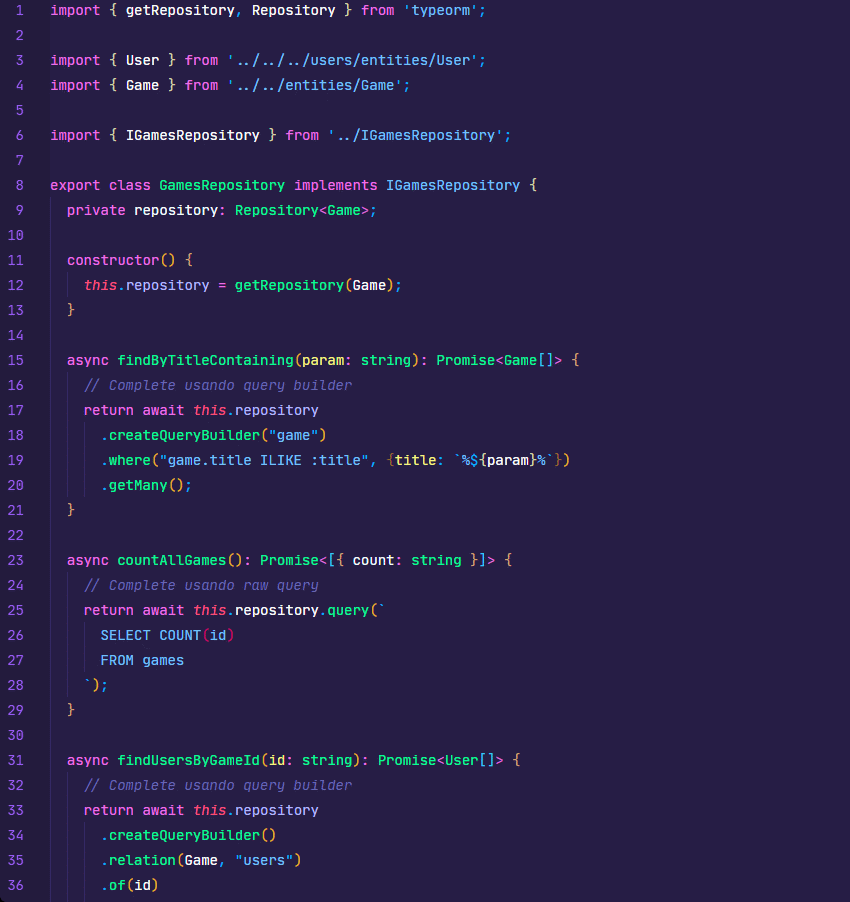
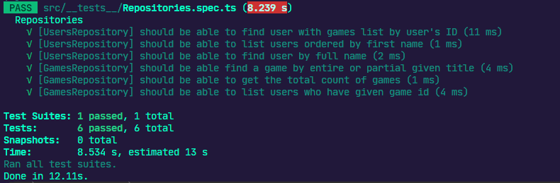

# Desafio 6 do Ignite Trilha NodeJS


<h3 align="center">
  Desafio 06: Database queries

</h3>

<p align="center">
  
  <a href="https://app.rocketseat.com.br/me/matheus-marins">
    
  </a>
  <a href="https://github.com/rocketseat-education/ignite-template-database-queries/stargazers">
      
    </a>
  </p>

---

# :rocket: Sobre o desafio

Nesse desafio, você realizei consultas no banco de dados com o TypeORM de três maneiras:

- Usando o ORM
- Usando Query Builder
- Usando Raw Query

Me ajudou a melhorar o entendimento e exercitar os diferentes tipos de consultas que podemos fazer.

No template, você irá encontrar uma aplicação já estruturada (apenas as entidades e repositórios) onde você deverá completar o que falta nas consultas dos dois repositórios.

A aplicação possui dois módulos: `users` e `games`. Um **usuário** pode ter vários jogos e um mesmo **jogo** pode estar associado a vários usuários.

 ### **Para saber tudo sobre o desafio acesse [NotionDesafio](https://www.notion.so/Desafio-01-Database-Queries-8d97dae581d5446e97555c43d301ee45#72df8690911b44aaa4fd40ac9da3408f).**
 
---
### :keyboard: Instalação e Execução do Projeto

- Clone este repositório

```
> git clone https://github.com/Mar0la/ignite-data-base-queries-main
```

- Navegue até o diretório principal do projeto

```
> cd ignite-data-base-queries-main
```

- Instale as dependências com o Yarn

```
yarn
```

- Rode a suite de testes

```
yarn test
```

- Execute o projeto

```
yarn dev
```
---
### **Resolução do Desafio**
  - GamesRepository 
    - 
  - UserRepository 
    - 

### **Retorno que devemos ter ao digitar  <code>yarn test</code>** no terminal
  

---

## FeedBack do Desafio
  - Achei um desafio tranquilo, foi bom para exercitar os conceitos de pesquisa no banco de dados.
---


